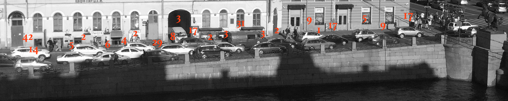

Сколько чисел в массиве?
=======================


*Небольшая предыстория. Этот пост я написал для двух целей. Во-первых, обкатать [конвертор разметки](http://habrahabr.ru/post/263213/) Markdown + $\LaTeX$ в хабрачитаемый вид. Во-вторых, рассказать об интересной задаче из data streaming. К концу написания, я обнаружил [пост про LogLog](http://habrahabr.ru/post/119852/) четырехлетней давности. На мою удачу автор предыдущего поста делал упор на реализацию. Я же, полагаясь на $\LaTeX$, расскажу больше о математике.*

Давайте представим, что у нас есть роутер. Через роутер проходит много пакетов по разным адресам. Нам интересно получить статистику, как много адресов задействовано в коммуникации. Есть пара проблем. 

* Пакетов так много, что запомнить их все нельзя. Сказать ушедшему пакету "Вернись! Я все прощу," — тоже. 
* Всех возможных адресов $2^{32}$. Столько памяти на роутере нет.



**Задача**. *Есть последовательность целых чисел $\sigma = a_1, a_2, \cdots, a_m$, все числа принимают значения от $0$ до $n - 1$. Требуется в один проход посчитать количество различных чисел, используя $\overline{o}(n + m)$ памяти*.

<!--cut Дальше --> 

Я расскажу вероятностный приближенный алгоритм Флажолета-Мартина. ТТХ алгоритма:

* использует $\mathcal{O}\left(\log \delta^{-1} (\log m + \log n)\right)$ памяти!
* работает на любом входе;
* находит ответ, который отличается от точного не более чем в 3 раза с вероятностью $1 - \delta$:
$$
\mathbf{Pr}\left[\; \text{FM}(\sigma) \in [\text{dist}(\sigma) \,/\, 3, \text{dist}(\sigma) \cdot 3]\;\right] \geq 1 - \delta,
$$
вероятность берется по случайным битам алгоритма. 

В конце поста я расскажу, почему точные детерминированные алгоритмы требуют $\Omega(\min(n, m))$ памяти.

### Алгоритм Флажолета-Мартина

Представим, что у нас есть отрезок действительных чисел $[0, 1]$. На отрезок мы независимо случайно кидаем $n$ точек согласно равномерному распределению. Какое будет расстояние между крайней левой точкой и нулем?

Можно предположить, что точки разделят отрезок на $n + 1$ меньших подотрезков примерно одинаковой длины. Если аккуратно записать матожидание расстояния и взять интеграл, мы получим
$$
\mathbf{E}\left[\;\min(x_1, \cdots, x_n) \;\right] = \int_0^1 x \cdot \left(n \cdot (1 - x)^{n - 1} dx \right) = \frac{1}{n + 1}.
$$
Пусть кто-то кинул случайно несколько точек на отрезок, и $d$ -- расстояние от нуля до крайней левой точки. Можно прикинуть, что всего точек порядка $\frac{1}{d}$. 

Идея алгоритма Флажолета-Мартина -- случайно бросить все числа последовательности $\sigma$ на отрезок $[0, 1]$, а затем найти расстояние от нуля до крайней левой точки. Если одинаковые числа будут всегда отображаться в одну точку, а разные независимо распределяться по отрезку, мы сможем прикинуть ответ. 

#### 2-независимые хэш-функции

Бросать числа на отрезок мы будем с помощью случайной хэш-функции. 

**Определение**. *Семейство хэш-функций $\mathcal{H} = \{h_i : K \rightarrow V\}_i$ называется 2-независимым, если для любых $k_1 \neq k_2 \in K$ и $v_1, v_2 \in V$*

$$
\mathbf{Pr}_{h \leftarrow U(\mathcal{H})}\left[\;h(k_1) = v_1 \text{ and } h(k_2) = v_2 \;\right] = \frac{1}{|V|^2}.
$$

Смысл определения в следующем. Зафиксируем два каких угодно ключа $k_1$ и $k_2$.
Ключи — различные. Посмотрим на случайные величины $h(k_1)$ и $h(k_2)$. Случайность задается выбором функции $h$. Тогда, по определению, величины $h(k_1)$ и $h(k_2)$ будут вести себя как независимые.

Как следствие, если взять всего один ключ $k$, то величина $h(k)$ будет равномерна распределена по $V$.

Для примера возьмем простое число $p$. Пусть $[p] = \{0, \cdots, p - 1\}$. $\mathcal{H}$ — это семейство всех линейных отображений по модулю $p$:
 $$h_{a, b}(x) = a \cdot x + b \text{ mod } p$$ 
 для $a, b \in [p]$. Тогда
 
$$
\begin{array}{l}
\mathbf{Pr}_{h}\left[\;h(k_1) = v_1 \text{ and } h(k_2) = v_2 \;\right] = \\ =
\mathbf{Pr}_{a, b}\left[\;\left\{\begin{array}{l}a \cdot k_1 + b = v_1 \text{ (mod }p) \\ a \cdot k_2 + b = v_2 \text{ (mod }p)\end{array} \right. \right] = p^{-2}.
\end{array}
$$

Поскольку $k_1 \neq k_2$, система имеет ровно одно решение среди $p^2$ возможных:
$$
\begin{array}{l}
a = (v_1 - v_2) \cdot (k_1 - k_2)^{p - 2} \text{ mod }p,\\
b = (k_1 \cdot v_2 - k_2 \cdot v_1) \cdot (k_1 - k_2)^{p - 2} \text{ mod } p.
\end{array}
$$

Поймем два важных момента. Во-первых, хранение такой функции обходится в $O(\log p)$ памяти, что очень немного. Во-вторых, если внимательно приглядеться, то можно понять, что вычисления проходят в поле $\mathbb{F}_p$, и могут быть обобщены для любого [конечного поля](https://ru.wikipedia.org/wiki/%D0%9A%D0%BE%D0%BD%D0%B5%D1%87%D0%BD%D0%BE%D0%B5_%D0%BF%D0%BE%D0%BB%D0%B5). 

В тестовом коде я буду использовать поле Галуа $\mathrm{GF}(2^{32})$. В описании далее можно считать, что у нас есть семейство хэш-функций $\mathcal{H} = \{h_i : [n] \rightarrow [n]\}_i$, где $n$ — степень двойки. Хранение одной функции занимает $O(\log n)$ памяти. 

#### Алгоритм

Пусть $n$ — степень двойки.
Перед стартом, алгоритм случайно выбирает хэш-функцию $h : [n] \rightarrow [n]$ из 2-независимого семейства.

Будем бросать элементы последовательности на отрезок $[0, 1]$. Берем очередное значение $a_i$ и записываем: ноль, точка, $h(a_i)$ в двоичном виде. Например, если $h(a_i) = 5 = 00101_2$, то получится число $0.00101_2$.

Обозначим через $\text{zero}(h(a_i))$ число лидирующих нулей в двоичной записи $h(a_i)$. Пусть $z = \max_i \text{zero}(h(a_i))$. Мы знаем, что минимальное значение лежит между $2^{-z}$ и $2^{-z - 1}$.

Ответ алгоритма: $2^{z + 0.5}$.

```python
def init():
	h = H.sample()
	z = 0
	
def process(a):
	z = max(z, zero(h(a))
	
def answer():
	return 2**(z + 0.5)
```
#### Анализ

Я планирую показать, что ответ алгоритма будет в 3 раза больше верного с вероятностью меньшей $0.48$. Аналогично, алгоритм вернет ответ в 3 раза меньше верного вероятностью меньшей $0.48$. Если вы не планируете углубляться в математику, смело переходите к следующей части.

Обозначим через $D$ множество всех различных чисел последовательности $\sigma$, а $d$ — их количество.

Для анализа алгоритма, нам потребуются два набора случайных величин.

* $X_{j, r} = \left[ \text{zero}(h(j)) \geq r \right]$. Принимает значение 1, если количество лидирующих нулей в двоичной записи $h(j)$ хотя бы $r$; иначе — $0$. 
* $Y_r = \sum_{j \in D} X_{j, r}$. Величина $Y_r$ больше нуля, если переменная $z$ по завершении алгоритма оказалась не меньше $r$.

Заметим, что вероятность $\mathbf{Pr}\left[\;X_{j, r} = 1\;\right] = 2^{-r}$: величина $h(j)$ равномерно распределена по отрезку $[0, n - 1]$; $n$ — степень двойки; есть всего $n \cdot 2^{-r}$ чисел с $r$ лидирующими нулями.

Значит, матожидание $\mathbf{E}\left[\;X_{j, r}\;\right] = 2^{-r}$. Ограничим сверху дисперсию 
$$
\mathbf{D}\left[\;X_{j, r}\;\right] = \mathbf{E}\left[\;X^2_{j, r}\;\right] - \mathbf{E}\left[\;X_{j, r}\;\right]^2 \leq \mathbf{E}\left[\;X^2_{j, r}\;\right] = \mathbf{E}\left[\;X_{j, r}\;\right] = 2^{-r}.
$$

Заметим, что дисперсия по величинам $X_{j, r}$ линейна. Для любых двух $i$ и $j$
$$
\mathbf{D}\left[\;X_{i, r} + X_{j, r}\;\right] = \mathbf{E}\left[\;(X_{i, r} + X_{j, r})^2\;\right] - \left(\mathbf{E}\left[\;X_{i, r}\;\right] + \mathbf{E}\left[\;X_{j, r}\;\right]\right)^2
$$
$$
\mathbf{E}\left[\;(X_{i, r} + X_{j, r})^2\;\right] = \mathbf{E}\left[\;X_{i, r}^2\;\right] + 2 \cdot \mathbf{E}\left[\;X_{i, r} \cdot X_{j, r}\;\right] + \mathbf{E}\left[\;X_{j, r}^2\;\right] 
$$
$$
\left(\mathbf{E}\left[\;X_{i, r}\;\right] + \mathbf{E}\left[\;X_{j, r}\;\right]\right)^2 = \mathbf{E}\left[\;X_{i, r}\;\right]^2 + 2 \cdot \mathbf{E}\left[\;X_{i, r}\;\right] \cdot \mathbf{E}\left[\;X_{j, r}\;\right] + \mathbf{E}\left[\;X_{j, r}\;\right]^2 
$$ 
Поскольку $X_{i, r}$ и $X_{j, r}$ независимы, то $\mathbf{E}\left[\;X_{i, r} \cdot X_{j, r}\;\right] = \mathbf{E}\left[\;X_{i, r}\;\right] \cdot \mathbf{E}\left[\;X_{j, r}\;\right]$. Значит, 
$$
\mathbf{D}\left[\;X_{i, r} + X_{j, r}\;\right] = (\mathbf{E}\left[\;X_{i, r}^2\;\right] - \mathbf{E}\left[\;X_{i, r}\;\right]^2) + (\mathbf{E}\left[\;X_{j, r}^2\;\right] - \mathbf{E}\left[\;X_{j, r}\;\right]^2) = \\ =  \mathbf{D}\left[\;X_{i, r} \;\right] +  \mathbf{D}\left[\;X_{j, r} \;\right].
$$

Более того, $\mathbf{D}\left[\;\sum_{j \in D} X_{j, r}\;\right] = \sum_{j \in D}\mathbf{D}\left[\;X_{j, r}\;\right]$, поскольку величины $X_{j, r}$ — 2-независимы.

Теперь рассмотрим величину $Y_r$.

* $\mathbf{E}\left[\;Y_r\;\right] = \mathbf{E}\left[\;\sum_{j \in D} X_{j, r}\;\right]= \sum_{j \in D} \mathbf{E}\left[\; X_{j, r}\;\right]= d \cdot 2^{-r}$ по линейности матожидания.
* $\mathbf{D}\left[\;Y_r\;\right] = \mathbf{D}\left[\;\sum_{j \in D} X_{j, r}\;\right]= \sum_{j \in D} \mathbf{D}\left[\; X_{j, r}\;\right]\leq d \cdot 2^{-r}$ по линейности дисперсии для 2-независимых величин.

Пусть $a$ — минимальное число такое, что $3 \cdot d \leq 2^{a + 0.5}$. Событие "алгоритм выдал ответ в 3 раза больше нужного" равносильно событию $z \geq a$ и равносильно событию $Y_a > 0$. Применяя [неравенство Маркова](https://ru.wikipedia.org/wiki/%D0%9D%D0%B5%D1%80%D0%B0%D0%B2%D0%B5%D0%BD%D1%81%D1%82%D0%B2%D0%BE_%D0%9C%D0%B0%D1%80%D0%BA%D0%BE%D0%B2%D0%B0), ограничим вероятность

$$
\mathbf{Pr}\left[\;FM(\sigma) \geq 3 \cdot d \;\right] = \mathbf{Pr}\left[\;z \geq a\;\right] = \mathbf{Pr}\left[\;Y_{a} > 0\;\right] = \mathbf{Pr}\left[\;Y_{a} \geq 1\;\right] \leq \mathbf{E}\left[\;Y_a\;\right]\;/\;1 = d \cdot 2^{-a} \leq\frac{\sqrt{2}}{3} \leq 0.48.
$$

Пусть $b$ — максимальное число такое, что $2^{b + 0.5} \leq d \;/\;3$. Аналогично, событие "алгоритм выдал ответ в 3 раза меньше нужного" равносильно событию $z \leq b$ и равносильно событию $Y_{b+ 1} = 0$. Применяя [неравенство Чебышёва](https://ru.wikipedia.org/wiki/%D0%9D%D0%B5%D1%80%D0%B0%D0%B2%D0%B5%D0%BD%D1%81%D1%82%D0%B2%D0%BE_%D0%A7%D0%B5%D0%B1%D1%8B%D1%88%D1%91%D0%B2%D0%B0), получим

$$
\begin{array}{l}
\mathbf{Pr}\left[\;FM(\sigma) \leq d\;/\;3 \;\right] = \mathbf{Pr}\left[\;z \leq b\;\right] = \mathbf{Pr}\left[\;Y_{b + 1} = 0\;\right] = \\ \\ =\mathbf{Pr}\left[\;\left|Y_{b + 1} - \frac{d}{2^{b+1}}\right| \geq  \frac{d}{2^{b+1}}\;\right] \leq \frac{\mathbf{D}\left[\;Y_{b +1}\;\right]}{(d \;/\;2^{b + 1})^2} = \frac{2^{b + 1}}{d} \leq \frac{\sqrt{2}}{3} \leq 0.48.
\end{array}
$$

#### Финальный аккорд: медиана

Осталось понять как понизить ошибку. Возьмем случай, когда алгоритм выдает слишком большой ответ. Запустим алгоритм параллельно $k$ раз и вернем медиану среди ответов. Я утверждаю, что если $k = \Omega(\log (\delta\;/\;2)^{-1})$, то алгоритм ошибется с вероятностью не больше $\delta\;/\;2$. Аналогично, ограничив ошибку в другую сторону, получим
$$

\mathbf{Pr}\left[\;FM_k(\sigma) \leq d\;/\;3 \vee FM_k(\sigma) \geq 3 \cdot d\;\right] \leq \mathbf{Pr}\left[\;FM_k(\sigma) \leq d\;/\;3 \right] + \mathbf{Pr}\left[\;FM_k(\sigma) \geq 3 \cdot d \right] \leq \delta.

$$

Почему медиана так работает? По неравенству Чернова. Заведем случайную величину $Z_i = [FM(\sigma) < 3 \cdot d]$. Величина $Z_i$ равна единице, если ответ алгоритма на $i$ запуске меньше $3 \cdot d$. Вероятность этого события не меньше 0.52.

Если медиана $k$ запусков алгоритма больше $3 \cdot d$, то это значит, что алгоритм хотя бы половину раз выдал ответ больший $3 \cdot d$ и $\sum_i Z_i \leq k \;/\;2$. Тогда по [неравенству Хефдинга-Чернова](https://en.wikipedia.org/wiki/Chernoff_bound#Precise_statements_and_proofs)
$$
\mathbf{Pr}\left[\;\sum_i Z_i \leq k\;/\;2 \;\right] \leq \mathbf{Pr}\left[\;\left| 0.52 \cdot k - \sum_i Z_i \right| \geq 0.02 \cdot k \;\right] \leq 2^{-c \cdot k},
$$
где $c$ — некоторая константа. Другой случай показывается аналогично.
 
### Нижняя оценка для точного алгоритма

Давайте представим, что кто-то действительно придумал детерминированный алгоритм, который в один проход находит точное число различных элементов в один проход. Мы покажем, что такой алгоритм должен использовать $\Omega(\min(n, m))$ памяти.

Возьмем множество $S \subset [n]$ размера $n \,/\, 2$ и положим его в качестве начала последовательности. Скормим эту часть алгоритму и посмотрим на его память.

Из одной только памяти алгоритма можно извлечь все множество $S$. Если скормить в текущем состоянии число $a \in S$, ответ алгоритма не изменится; если $a \not\in S$, то увеличится на 1. Значит, каждому множеству $S$ должно соответствовать свое уникальное состояние памяти.

Различных подмножеств из $[n]$ размера $n\,/\,2$ примерно $2^n\,/\,n$. Если мы хотим каждому множеству сопоставить битовую строку, нам потребуется $\Omega(\log (2^n \,/\,n)) = \Omega(n)$ 
 
### Что почитать


1. "Probabilistic Counting Algorithms for Data Base Applications", Flajolet, Martin, 1983, [link](http://www.mathcs.emory.edu/~cheung/papers/StreamDB/Probab/1985-Flajolet-Probabilistic-counting.pdf). 
2. "The space complexity of approximating the frequency moments", Alon, Matias, Szegedy, 1999, [link](http://www.tau.ac.il/~nogaa/PDFS/amsz4.pdf).
